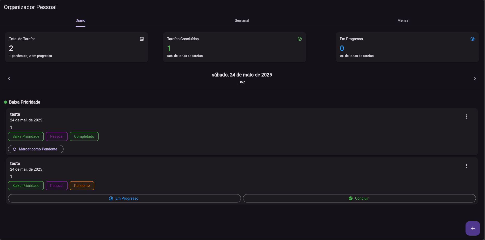
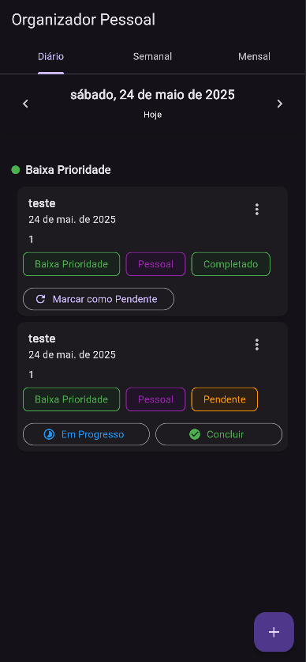
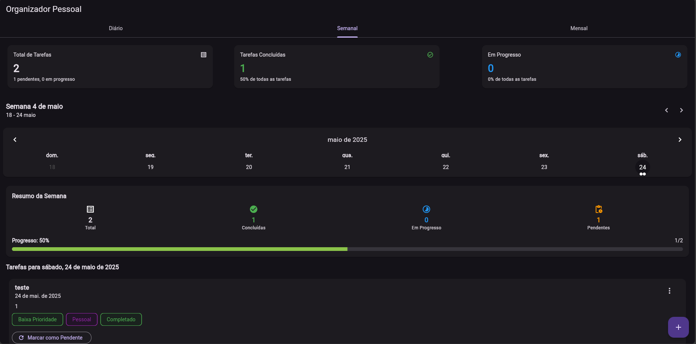
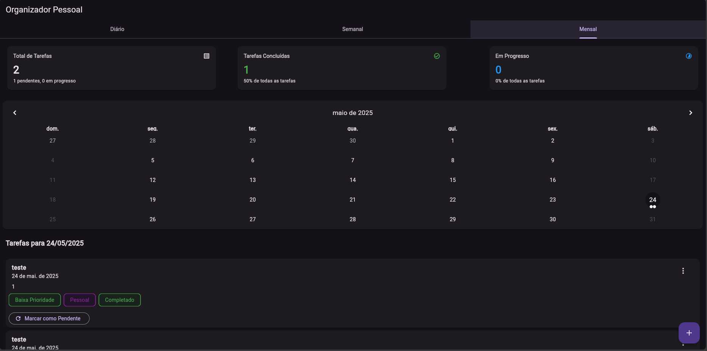
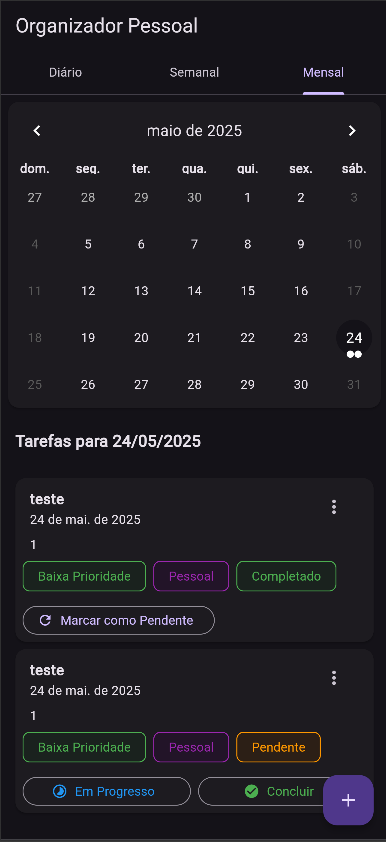
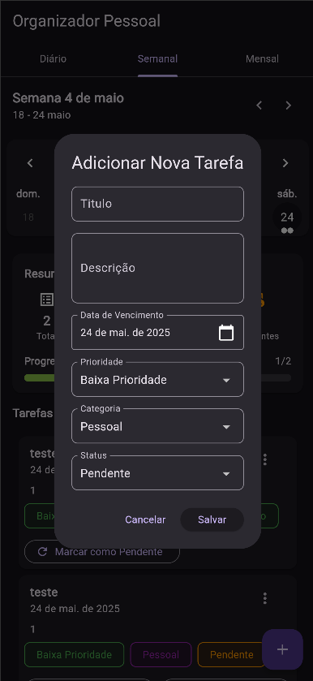

# task_planner

## Todo

    - [x] componentizar no dialogs
      - [x] fields
      - [x] dropdowns
      - [x] select date
    - [x] refatorar as cores e infos referentes a enuns (TaskStatus, TaskPriority, TaskCategory)
    - [x] refatorar a construção dos botões de status no card da task
    - [x] corrigir layout mobile
    - [ ] adicionar tradução por localização
    - [ ] adicionar alertas de errors com a mensagem
    - [ ] melhorar a validação ao criar/editar uma task

## Como rodar o projeto

Em uma pasta para salvar o projeto abra o CMD

- Clone o projeto

```git
git clone https://github.com/RobertsFerreira/task_planner.git
```

- No **CMD/IDE** na pasta do projeto clonado acesse a pasta task_planner
- No CMD ou console da IDE na pasta do projeto digite os comandos em sequencia.
  - flutter pub get
  - flutter run --release
  - Escolha o navegador no qual deseja rodar o projeto.

## Prints ou vídeos mostrando como o app ficou
  
- Versão web desktop
  
  

- Versão web mobile

  

- Visualização Semanal

  
  

- Visualização Mensal

  
  

- Adição/Edição de tarefas
  
  

## Explicações sobre decisões técnicas, arquitetura, bibliotecas utilizadas, etc

  Neste projeto foi utilizado um padrão inspirado no **MVC**, onde os providers fazem o papel do controller.
  
  A decisão de utilizar o MVC foi tomada com o objetivo de deixar o projeto simples mas legível arquiteturalmente por ser um projeto bem simples.
  
  Já na escolha de bibliotecas o uso do **provider** para gerenciamento de estado teve o propósito voltado para estudo, por utilizar ele em poucos projetos, tive a ideia de utilizar nesse por ser simples e diferente do dia a dia.
  
  O uso do **shared_preferences** foi escolhido pela simplicidade para salvar os dados e o uso dentro da aplicação para mantela simples.
  
  O restante das bibliotecas foram por conforto e facilidade que trazem, como o **intl** apresenta uma facilidade na formatação de valores para apresentação ao usuário e o **table_calender** apresentando varias opções de customização de calendários.

## Se você usou IA (por exemplo: para gerar código, estruturar ideias, montar interface), explique como e por quê no README

  A utilização da IA dentro do projeto teve dois objetivos, utilizado na geração de ideias de layout e na geração de código, códigos para resolução de bugs e ideias de arquitetura e uso do provider no projeto.

  Para o layout foi utilizado a [V0](https://v0.dev/), mesmo gerando o código em **react** da para obter ideias de layout para fazer e caso queira pedir ela para transcrever para **dart/flutter**. Para ele gerar o layout pedi para gerar um layout com o objetivo da aplicação ser um gerenciador de tarefas pessoal e após isso analisei ele e fui solicitando melhorias nele apontado o local ou indicando a informação a ser adicionada.
  
  Para correções de bugs, retiradas de duvida sobre uso do provider foi utilizado o [GPT](https://chatgpt.com/) e o [CLAUDE](https://claude.ai/). Nas correções de bugs era repassado a mensagem de erro e pedia a explicação do motivo dele ocorrer, principalmente para bugs de layout, quando havia dúvidas de como era utilizado o provider, para isso eu utilizava de exemplos do codigo montado com outras bibliotecas, como o MOBX e pedia para ele demonstrar como seria a ideia usando o provider.

## Outros detalhes que achar relevantes sobre seu processo criativo e de desenvolvimento
